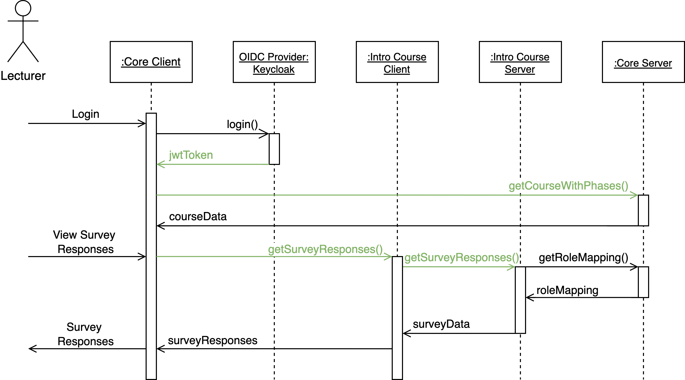
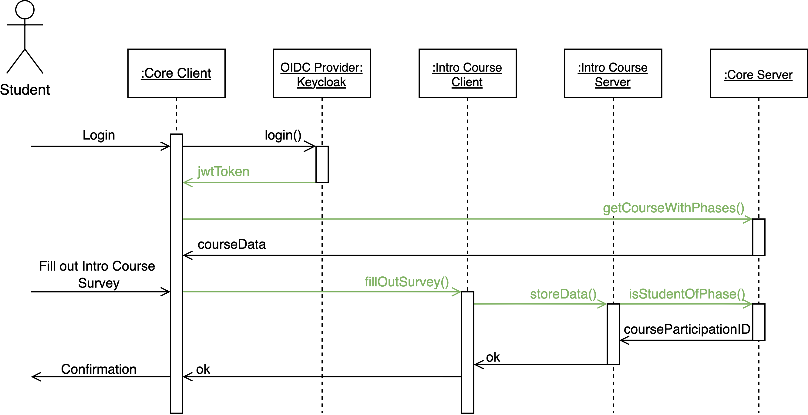

# 🔐 Access Control

PROMPT 2 uses **role-based access control (RBAC)** to manage user permissions throughout the system. This is implemented through **Keycloak**, which issues JSON Web Tokens (JWTs) and manages both system-wide and course-specific roles.

The platform distinguishes four main user types:

* Administrator
* Lecturer
* Teaching Personnel
* Student

Based on these, the system defines **five roles**, each with specific permissions:

## 🎓 Access Roles

| Role                     | Scope           | Description                                                                                                                                                              |
| ------------------------ | --------------- | ------------------------------------------------------------------------------------------------------------------------------------------------------------------------ |
| **Prompt Administrator** | System-wide     | Full access to all courses, users, and settings. Handles configuration and maintenance.                                                                                  |
| **Prompt Lecturer**      | System-wide     | Can create new courses and view student history across all past courses.                                                                                                 |
| **Course Lecturer**      | Course-specific | Assigned when creating a course. Can configure course structure, manage phases, assess students, and assign final grades.                                                |
| **Course Editor**        | Course-specific | Supports course execution. Can view participants and progress but cannot write data or assess students. May gain additional permissions per phase (e.g., give feedback). |
| **Course Student**       | Course-specific | Can apply to courses, participate in phases, and view their progress and grades.                                                                                         |

---

## 🧩 Role Resolution and Enforcement

The PROMPT 2 system distinguishes **system-wide roles** from **course-specific roles**.

### 🔐 System-Wide Roles: `Prompt Administrator` and `Prompt Lecturer`

These roles are managed directly in **Keycloak** and are encoded in each user's **JWT token**. Any component (core or course phase service) can validate these roles by inspecting the token.

### 📘 Course-Specific Roles: `Course Lecturer` and `Course Editor`

These roles are dynamically created and linked to specific courses. The role names are generated with a naming convention that includes the **semester** and **course name** (e.g., `ios25-iPraktikum-Lecturer`). Because services typically operate using internal identifiers like `courseID` or `coursePhaseID`, they must map these IDs to role names.

To support this, the **Core Server provides an endpoint** that returns the correct role name for a given course or phase ID. Services can then:

1. Request the role name using the ID
2. Check whether the user’s JWT contains the required role
3. Cache the result, since mappings rarely change

### 🧪 Example: Course Lecturer Access Flow

In this flow:

* A lecturer logs in through the Core Client, which authenticates via Keycloak.
* Keycloak issues a JWT token, which the client uses to retrieve associated courses from the Core Server.
* When the lecturer accesses a course phase (e.g., the Intro Course), the microfrontend sends a request to the respective course phase service.
* This request includes the `jwtToken` and `coursePhaseID`.
* The course phase service contacts the Core Server to resolve the `coursePhaseID` into a role name.
* It checks the JWT for the corresponding role before allowing access.

Note: This role mapping is public and not user-specific. Therefore, it does **not** require authentication and can be **cached safely**.

---

## 👩‍🎓 Student Role and Phase Participation

The `Course Student` role is handled differently. Because student access is **phase-dependent** and students progress from phase to phase dynamically, their membership **cannot** be captured in static Keycloak roles.

Instead, the **Core Server maintains authoritative information** about which students are allowed in which phases. Course phase services must verify student membership using the **dedicated Core endpoint**.

### 🧪 Example: Course Student Access Flow

In this flow:

* A student logs in and receives a JWT token from Keycloak.
* The Core Client only shows courses and phases the student is currently enrolled in.
* When accessing a course phase (e.g., a survey in the Intro Course), the phase service:

  1. Sends the `jwtToken` and `coursePhaseID` to the Core Server
  2. Core verifies that the student is part of the phase
  3. Returns the `courseParticipationID`
  4. The phase service uses this ID to record progress (e.g., survey response)

Because phase participation may change (e.g., after passing a phase), the membership check result **should not be cached long-term**.

---

## 🎯 Custom Roles for Fine-Grained Access

PROMPT 2 also supports the creation of **custom Keycloak roles** for advanced access scenarios. Instructors can define roles for specific course phases and assign them to users as needed.

These custom roles:

* Do **not** inherit permissions from system-defined roles
* Can be used by phase services to define access levels such as team membership or feedback permissions

Example: A course phase service may define team roles (`team-1`, `team-2`) and use them to differentiate student permissions within a team-based project.

---

## ✅ Summary

| Role Type            | Defined In  | Scope        | Validated Using       |
| -------------------- | ----------- | ------------ | --------------------- |
| Prompt Administrator | Keycloak    | System-wide  | JWT inspection        |
| Prompt Lecturer      | Keycloak    | System-wide  | JWT inspection        |
| Course Lecturer      | PROMPT Core | Per Course   | Mapped role + JWT     |
| Course Editor        | PROMPT Core | Per Course   | Mapped role + JWT     |
| Course Student       | PROMPT Core | Per Phase    | Membership endpoint   |
| Custom Role          | Keycloak    | Custom Logic | Service-defined usage |

