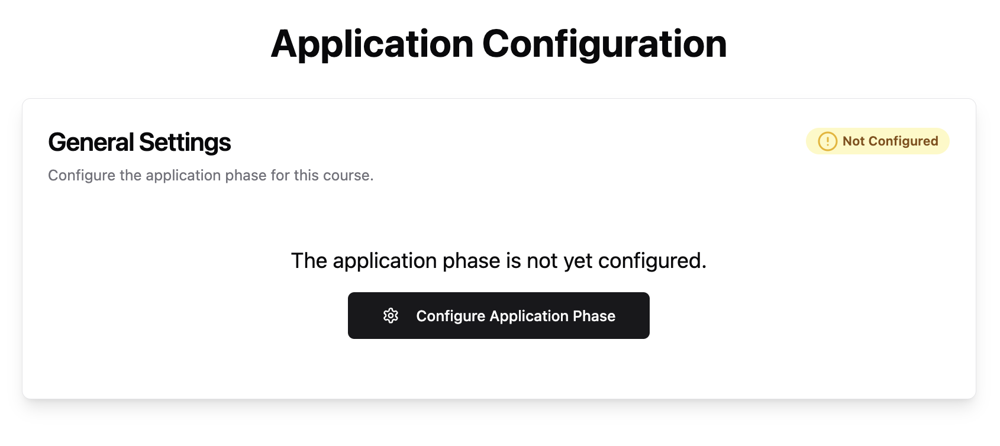
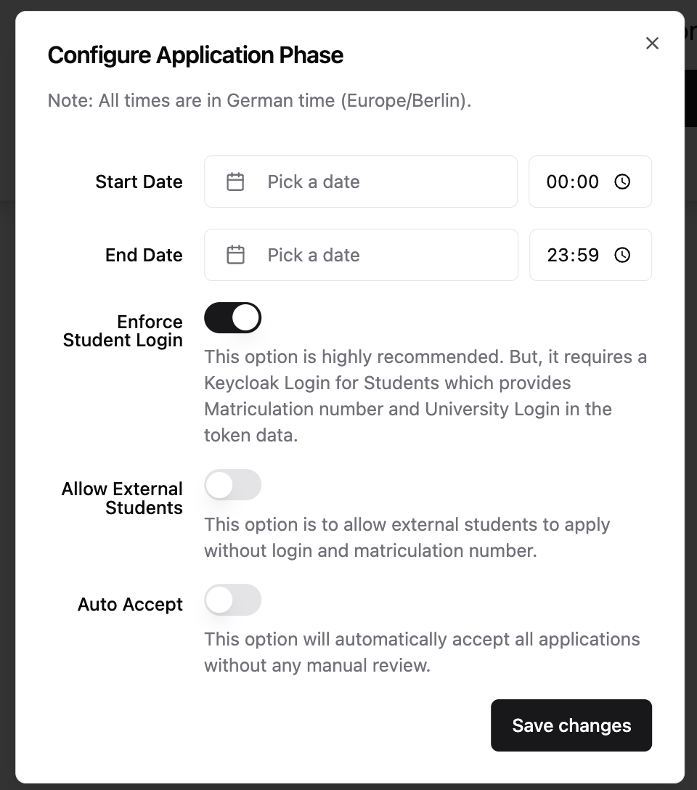
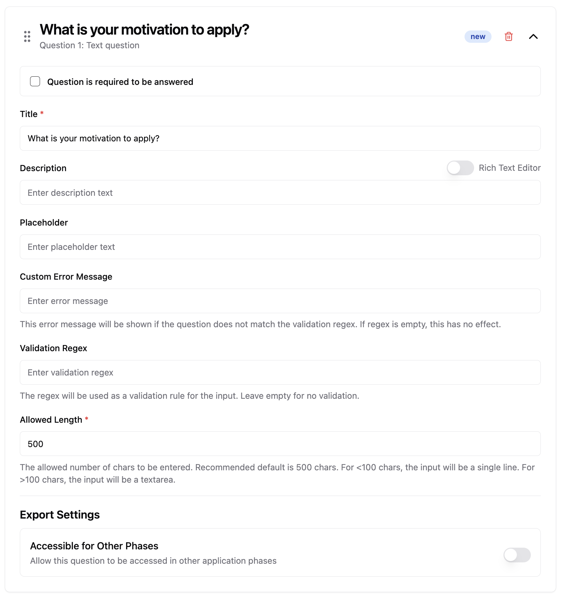
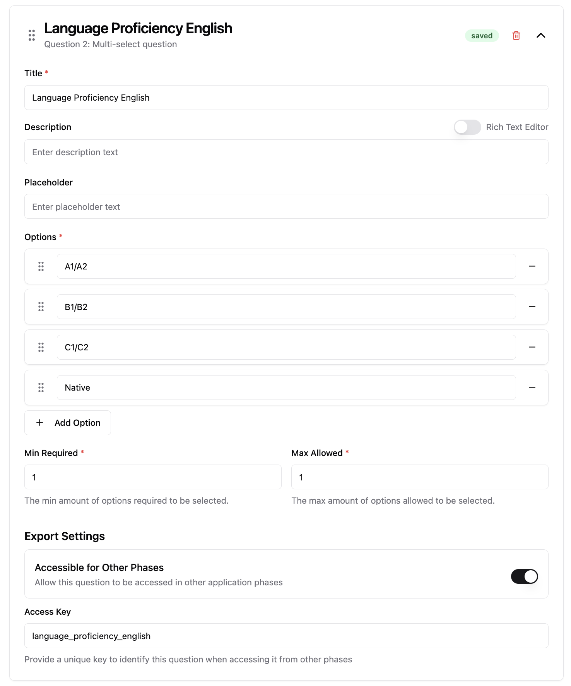
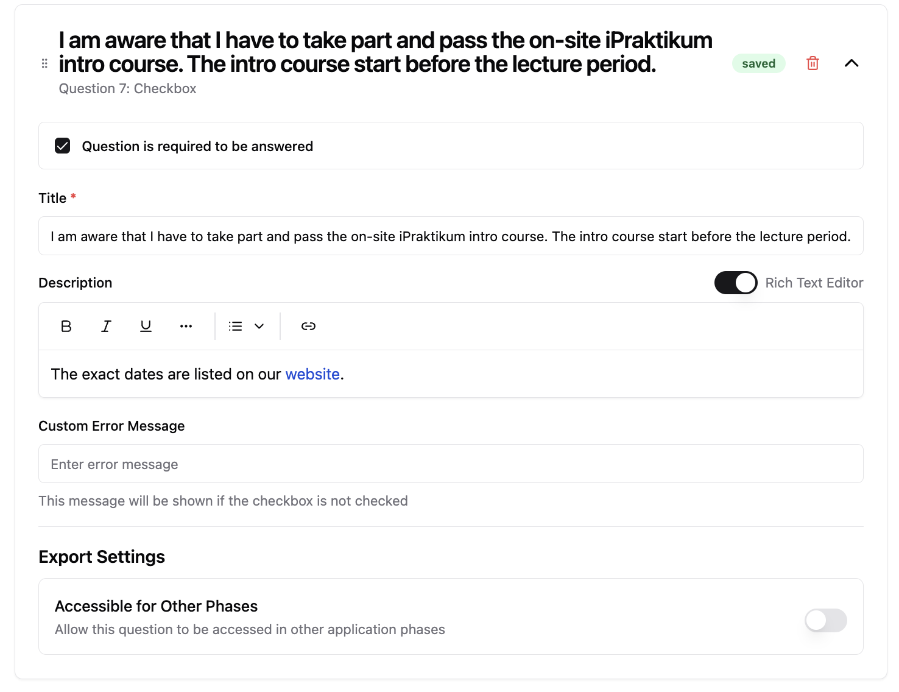

# 📋 Application Course Phase

🎥 **Video Tutorial**: [Watch here](https://live.rbg.tum.de/w/artemisintro/60491)

The **Application Phase** enables instructors to create application forms for students and manage their submissions. Students can apply to a course by answering a customizable set of questions defined by the instructor.

---

## ⚙️ Setting Up the Application Phase

To configure the application phase, follow these steps:

### 1. Add an Application Phase

Use the Course Configurator to add an **Application Phase** to your course structure.

### 2. Open the Configuration

In the course sidebar, select the newly added application phase, then click on: `Configure Course Phase`

This opens a dialog for setting the phase's behavior and schedule.

### 3. Configure General Application Settings

You must define a start and end date. These timestamps use the **system time (Europe/Berlin)**. If students access the application from other time zones, a note will be shown to clarify that deadlines refer to the German time zone.

You can also configure the following options:

| Option                      | Description                                                                                                                                                                |
| --------------------------- | -------------------------------------------------------------------------------------------------------------------------------------------------------------------------- |
| **Enforce Student Login**   | Requires students with a university login and matriculation number to log in via Keycloak. Recommended in most cases. Disable only for self-hosted, non-university setups. |
| **Allow External Students** | Allows students without university credentials (e.g., exchange students) to submit applications.                                                                           |
| **Auto Accept Application** | Automatically accepts every application. Use this only when the application serves as a simple registration form.                                                          |

---

## 🧩 Creating Application Questions

Once you've configured the start and end time, you can begin adding application questions. Click **Add Question** and choose one of the following types:

* Text Question
* Multi-Select Question
* Checkbox Question

You can **reorder questions** via drag-and-drop.

To preview the application as it will appear to students, use the **Student Preview** feature.

---

## 📝 Question Types

Below are details and configuration options for each available question type:

---

### ✏️ Text Question

Use this for open-ended answers such as motivation, experience, or personal information.

**Fields:**

* **Required Checkbox**: Mark if the question must be answered.
* **Title** *(required)*: The question prompt.
* **Description**: Optional additional instructions.
* **Placeholder**: Sample text inside the input field.
* **Custom Error Message**: Message shown if input fails regex validation.
* **Validation Regex**: A regular expression for validating the response. I.e. to restrict the input to a number format or an UUID.
* **Allowed Length** *(required)*: Max character count.

  > If ≤100 characters → single-line input
  > If >100 characters → textarea
* **Export Settings → Accessible for Other Phases**: Toggle to make answers available in future phases. Enter a key, with which the answer will be accessible in the following course phases (if configured in the course configurator)

---

### ✅ Multi-Select Question

Use this to allow students to choose one or more options from a predefined list.

**Fields:**

* **Title** *(required)*: The question prompt.
* **Description**: Optional additional info.
* **Placeholder**: Text displayed when no option is selected.
* **Options** *(required)*: Add as many options as needed.
* **Min Required / Max Allowed** *(required)*: Define how many options a student must select (e.g., select at least 1, at most 3). If min and max are both set to 1, then it will be displayed as a Single Select to the student.
* **Export Settings → Accessible for Other Phases**: Enable to share responses across later phases.

---

### ☑️ Checkbox Question

Use this for confirmations, declarations, or consent (e.g., "I agree to the terms").

**Fields:**

* **Required Checkbox**: Specify whether this must be checked to proceed.
* **Title** *(required)*: The statement the student must confirm.
* **Description**: Optional explanatory text.
* **Custom Error Message**: Shown if the box must be checked but is left empty.
* **Export Settings → Accessible for Other Phases**: Enable if later phases should access the response.
