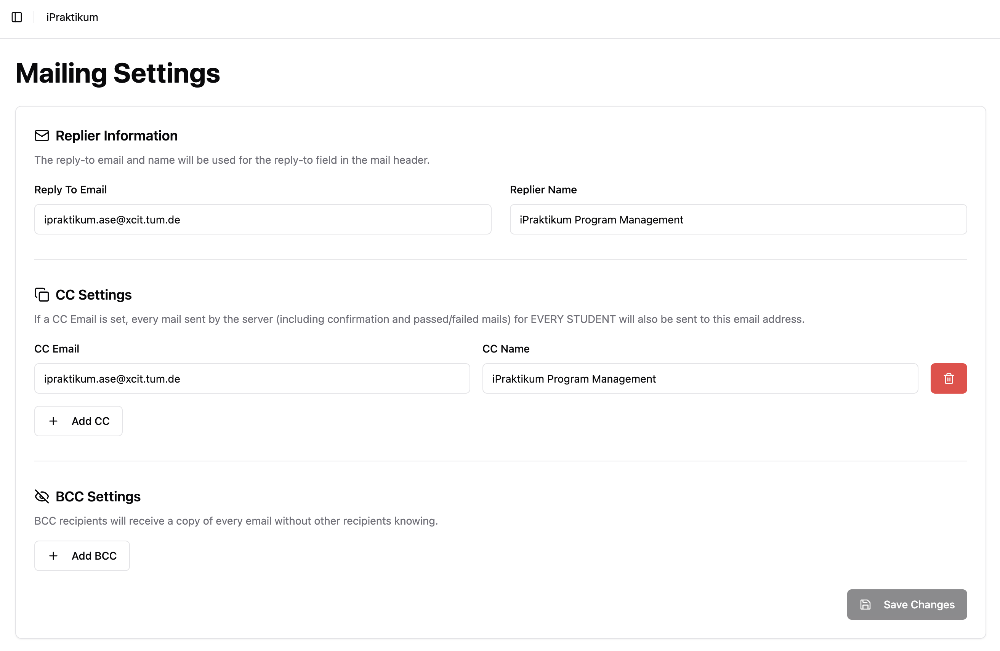
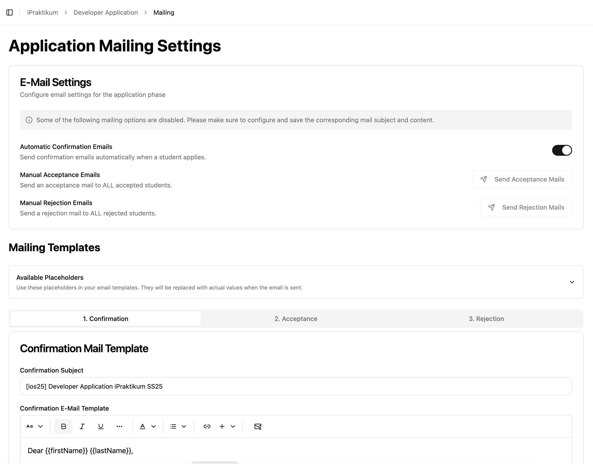
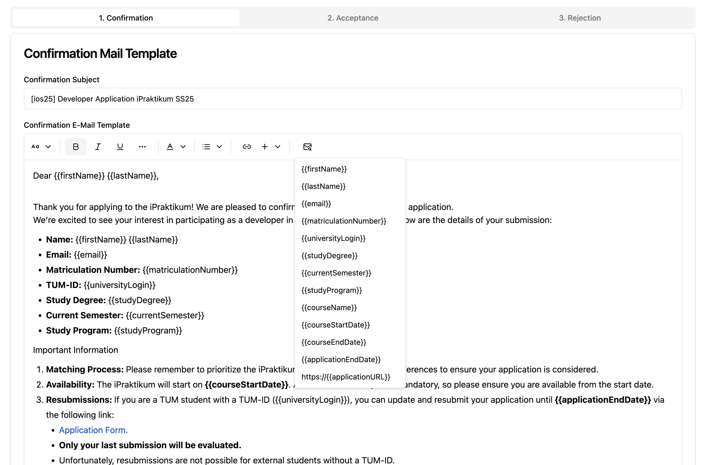

# 📬 Mailing Configuration

PROMPT supports customizable email communication. This guide explains how to configure mailing settings and use email templates effectively.

---

## 🧩 Course-Wide Mailing Settings

You can access the course-wide mailing settings via the **"Mailing Settings"** entry at the top of the course sidebar.

### ✉️ Reply-To Email Address (Required)

* This is the email address students can reply to when they receive mails from prompt.
* It must be a valid and monitored address (e.g., `course-team@example.com`).
* This is a mandatory field. You cannot send mails without specifying a reply-to email.

### 📥 CC / BCC Email Addresses (Optional)

* **CC (Carbon Copy)**: All outgoing emails will also be sent to these addresses, visible to recipients.
* **BCC (Blind Carbon Copy)**: Outgoing emails will be sent to this addresses without students seeing it.
* This is useful for archiving communications, quality assurance, or confirming that messages were sent.

> 💡 Tip: Use BCC to log all student communication without exposing internal email addresses.

---

## 📤 Course Phase-Specific Mailing Settings

Each course phase that supports email communication (e.g., Application Phase) includes a **“Mailing”** section in its sidebar. From there, you can:

* Write or edit email templates
* Trigger email delivery
* Configure automatic mailing behavior

---

### ✍️ Available Email Templates

The course phase services offer the following mail options:

| Mail Type             | Available In           | Description                                             |
| --------------------- | ---------------------- | ------------------------------------------------------- |
| **Confirmation Mail** | Application Phase only | Sent immediately after a student submits an application |
| **Acceptance/Passed** | All applicable phases  | Sent to students who have passed or been accepted       |
| **Rejection/Failed**  | All applicable phases  | Sent to students who did not pass or were rejected      |

Each template includes:

* **Subject**: The email subject line
* **Body**: A rich text editor that supports formatting and placeholders

---

### 🔧 Placeholders

You can personalize emails using placeholders that are automatically replaced with real values during sending.
You can find all available placeholders by clicking envelope icon in the rich text editor (see screenshot).

Examples (not exhaustive list):

| Placeholder           | Replaced With              |
| --------------------- | -------------------------- |
| `{{firstName}}`       | Student's first name       |
| `{{lastName}}`        | Student's last name        |
| `{{courseName}}`      | Name of the current course |
| `{{coursePhaseName}}` | Current phase name         |

---

## 📩 Sending Emails

At the top of the Mailing page in each course phase, you’ll find toggles and actions for controlling mail delivery:

### 1. ✅ Auto-Send Confirmation Mail (Application Phase Only)

* When enabled, students automatically receive the confirmation email immediately after submitting their application.
* Useful for letting students know their application was successfully received.

### 2. 📤 Send Acceptance / Passed Emails

* Sends the **Acceptance** or **Passed** email to **all students who passed** the course phase.
* Requires manual confirmation before sending.
* ⚠️ This action is **one-time**: the system does **not track** if an email has already been sent.

### 3. 📤 Send Rejection / Failed Emails

* Sends the **Rejection** or **Failed** email to **all students who did not pass** the course phase.
* As with acceptance mails, the system does **not track** delivery status, so use this action with care.

Students who do not have a status assigned, when sending out the mails, will not receive any email. 

---

## ✅ Best Practices

* Use BCC logging to maintain an audit trail.
* Avoid re-sending acceptance/rejection mails unless necessary.
* Include contact information in your reply-to address to allow follow-up questions from students.
