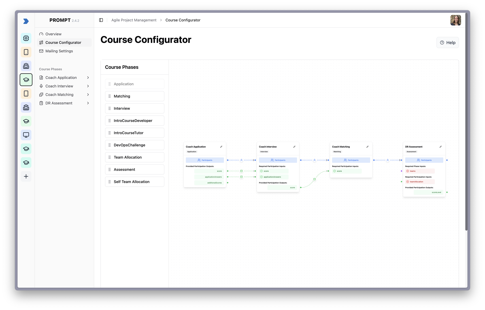
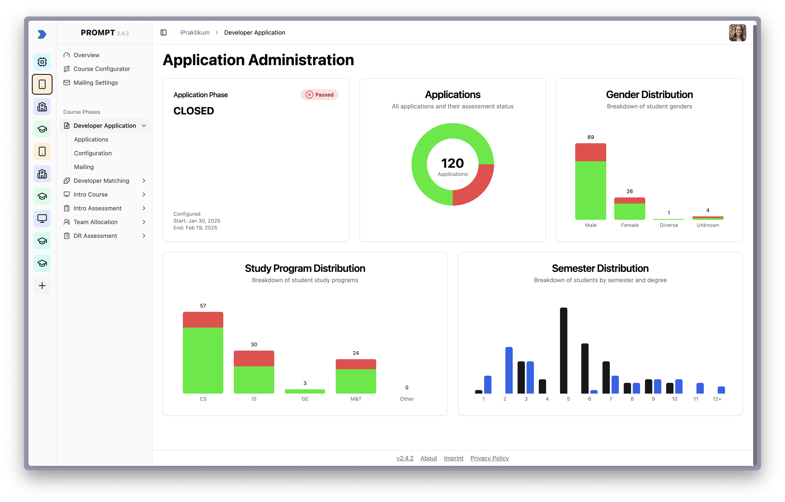
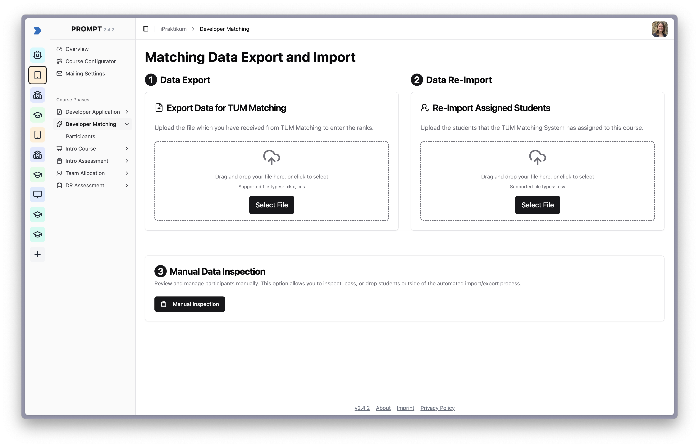

# PROMPT 2.0: A Modular and Scalable Management Platform for Project-Based Teaching

## What is PROMPT?

**PROMPT (Project-Oriented Modular Platform for Teaching)** is a course management tool built to simplify the administration of project-based university courses.

Originally developed for the **iPraktikum** at the **Technical University of Munich**, PROMPT is now a **modular and extensible platform** that adapts to the needs of instructors and scales across different teaching formats.

### Key Features

#### Core Features

- **Course Configuration:** Build custom course flows using reusable course phases.
- **Student Management:** Manage participant data and applications.
- **Application Phase:** Streamlined workflows for student applications.

#### Dynamically Loaded Course Phases

PROMPT supports custom course phases as independently deployable modules:

- 🗓 **Interview Phase** – Schedule and manage student interviews.
- 🧑‍🤝‍🧑 **Team Phase** – Allocate students to projects and teams.
- 📄 **TUM Matching Export** – Export data in TUM-compatible format.
- 🧩 **Custom Phases** – Easily extend PROMPT with your own logic.

---

## Guide to PROMPT

Explore the live system here 👉 [https://prompt.aet.cit.tum.de/](https://prompt.aet.cit.tum.de/)

PROMPT is built for teaching teams who run complex project-based university courses. This guide gives you a first impression of the product, its modules, and typical workflows.

### Build and Configure Courses

PROMPT lets you define courses by combining reusable “phases”:

- Add application, interview, matching, and many more phases
- Define prerequisites and outcomes for each phase



---

### Manage Students and Teams

PROMPT provides powerful tools for handling student participation throughout your course:

- Track incoming applications and monitor their progress
- Schedule and conduct interviews with applicants
- Form teams and assign projects using manual or semi-automated workflows
- Evaluate student performance on a **per-phase basis**, enabling you to decide who passes or fails at each stage of the course independently





---

### Extend PROMPT with Custom Phases

Each course phase can be developed and plugged in independently—ideal for institutions with evolving or specialized workflows.

---

## Development Guide

This section is for **developers and contributors** looking to run PROMPT locally or contribute to its development.

### Project Structure

#### Clients

- Built with **React**, **TypeScript**, and **Webpack Module Federation**
- Micro-frontends for each course phase
- Shared design system using [`shadcn/ui`](https://ui.shadcn.com/)

#### Server

- Developed in **Go**
- Core service + modular service architecture for each course phase
- **PostgreSQL** for data storage
- **Keycloak** for authentication

---

### Getting Started

#### Prerequisites

- [Node.js](https://nodejs.org/)
- [Yarn](https://yarnpkg.com/)
- [Go](https://go.dev/)
- [Docker](https://www.docker.com/)

#### API Spec Generation (Swagger)

We generate and commit swagger specs for the Go servers. To avoid forgetting this, install the repo-managed git hooks:

```bash
./scripts/install-githooks.sh
```

When you commit changes under `servers/core/` or `servers/template_server/`, the pre-commit hook regenerates and stages the swagger docs. Ensure `swag` is available on your PATH (`go install github.com/swaggo/swag/cmd/swag@latest`).

#### Running the Clients

1. Navigate to the client directory:

   ```bash
   cd clients
   ```

2. Install dependencies:

   ```bash
   yarn install
   ```

3. Start the development clients:

   ```bash
   yarn run dev
   ```

   This command uses `lerna` to launch all micro frontends simultaneously. To start a specific micro frontend, navigate to its subdirectory and run the development command there.

#### Running the Server

1. Navigate to the server directory:

   ```bash
   cd server
   ```

2. Start the server in development mode:

   ```bash
   go run main.go
   ```

#### Running Supporting Services

```bash
docker-compose up db keycloak
```

To run the server in Docker alongside these services:

```bash
docker-compose up
```

---

## Configuration

PROMPT can be customized for your course by composing it from different modular phases. These configurations are handled at the course level and dynamically loaded on demand.
